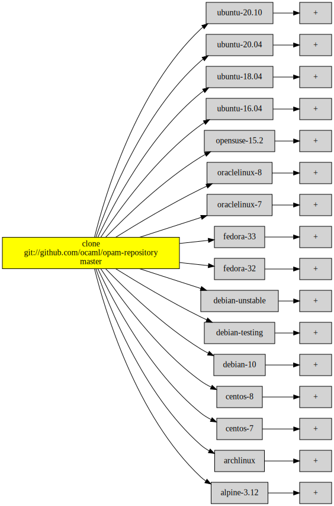

Status: **experimental**

This is an [OCurrent][] pipeline that builds Docker images for OCaml, for
various combinations of Linux distribution, OCaml version and architecture.

The resulting images can be run as e.g.

```
docker run --rm -it ocurrent/opam:debian-10-ocaml-4.08
```

(this is a temporary location and will likely change in future)

These images are very similar to the ones currently available as `ocaml/opam2`,
and use the same scripts from [avsm/ocaml-dockerfile][].
However, they are much smaller because each image only includes one OCaml compiler.

Each image includes two Dockerfiles showing how it was made:

- `/Dockerfile.opam` is the first stage, which just installs the `opam` binary.
- `/Dockerfile.ocaml` builds on the first stage by installing a particular opam switch.

The rest of this README is about working on the build pipeline.

## Testing locally

To see the pipeline, clone the repository and run it:

```bash
git clone --recursive https://github.com/talex5/ocaml-base-images.git
cd ocaml-base-images
opam pin -yn ./ocurrent
opam pin -yn ./ocaml-dockerfile
opam pin -yn .
opam -y depext -y base-images
opam install -y --deps-only base-images
dune exec -- ./src/base_images.exe --confirm harmless
```

Running with `--confirm harmless` means that it will just show what it plans to do without trying to run any jobs yet.
You should see:

```
Password file "/run/secrets/ocurrent-hub" not found; images will not be pushed to hub
   current_web [INFO] Starting web server: (TCP (Port 8080))
```

If you now browse to <http://127.0.0.1:8080> you can see the (rather large!) build pipeline.
It should look something like this (but less green initially):

<p align='center' style='max-width: 50%'>
  
</p>

It starts by cloning opam-repository,
then creates images by installing an `opam` binary and a copy of opam-repository
for many Linux distributions and architectures.

These architecture-specific images get pushed to a staging repository on Docker Hub,
and are then combined into a single multi-arch image.

Separately, the architecture-specific base images are also used to create more images -
one for each supported OCaml compiler version.
These images are also pushed to a staging repository and then combined into multi-arch images.

If you use the web user interface to set the confirmation threshold to `>= Average`, it will clone opam-repository.
However, before going further you will need to configure the builders.

The configuration is in [conf.ml][].
You can change the repositories to which the images will be pushed here, and provide a way to get your Hub password.
For testing, you'll probably want to uncomment the lines near the bottom to restrict the build to just a few combinations.

The default configuration assumes that your local Docker engine builds `X86_64` images and that you have set up Docker
contexts `arm64` and `ppc64` for those architectures.
To set up a Docker context, use e.g. `docker -H ssh://example.com context create arm64`.

The pipeline is defined in [pipeline.ml][].
This includes the Dockerfile definitions used to build the images.

Once running with your chosen configuration, you can use the web UI to raise (or remove) the confirmation threshold.

## The real deployment

The builder currently runs on `ci.ocaml.org`.
The configuration is in `stack.yml`.
To update it:

```
docker --context ci stack deploy -c stack.yml base-images
```

If you are doing your own deployment, you will need to provide some secrets (using `docker secret create`):

- `ocurrent-hub` is the Docker Hub password, which is used to push the images.
- `ocurrent-ssh-key` is needed for any builders that are accessed over SSH.
- `ocurrent-tls-key` is needed for any builders that are accessed over TLS.

[OCurrent]: https://github.com/talex5/ocurrent
[pipeline.ml]: https://github.com/talex5/ocaml-base-images/blob/master/src/pipeline.ml
[conf.ml]: https://github.com/talex5/ocaml-base-images/blob/master/src/conf.ml
[avsm/ocaml-dockerfile]: https://github.com/avsm/ocaml-dockerfile
